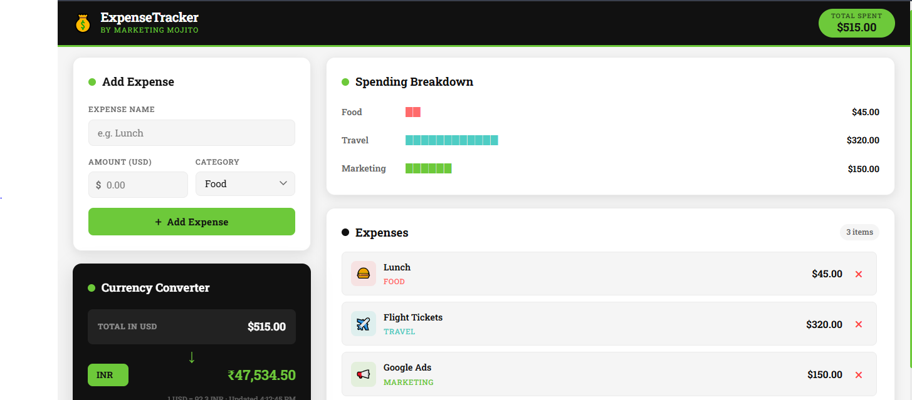
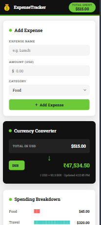

# 💰 Expense Tracker

A clean, responsive personal expense tracker built with **React + Vite** — featuring live multi-currency conversion, category breakdowns, and graceful error handling.

> Built as part of the **Marketing Mojito Web Developer Intern Assignment**

---

## 🚀 Live Demo

🔗 [View Live App](https://expense-tracker-alpha-six-91.vercel.app/) &nbsp;|&nbsp; 📁 [GitHub Repository](https://github.com/vanshsuri07/Expense-Tracker)

---

## 📸 Preview

| Desktop (1600px) | Mobile (414px) |
| ---------------- | -------------- |

<p align="center">
  
  
</p>

---

## ✨ Features

- **Add & Delete Expenses** — Log expenses with a name, amount, and category
- **Live Running Total** — Updates instantly as entries are added or removed
- **Category Breakdown** — Visual text-bar chart showing spending per category
- **Live Currency Conversion** — Real-time rates via Frankfurter API (30+ currencies)
- **Fully Responsive** — Works at 1600px desktop and 414px mobile
- **Error & Loading States** — UI never breaks or goes blank on API failure

---

## 🧱 Component Structure

```
src/
├── App.jsx                      # Root component, state management
└── components/
    ├── ExpenseForm.jsx          # Add new expense (name, amount, category)
    ├── ExpenseList.jsx          # Scrollable list with delete functionality
    ├── SummaryPanel.jsx         # Category breakdown with █ bar chart
    └── CurrencyConverter.jsx    # Live USD → X conversion via API
```

Each component has a corresponding **CSS Module** for scoped, conflict-free styling.

---

## 🛠️ Tech Stack

| Tool            | Purpose                                |
| --------------- | -------------------------------------- |
| React 18        | UI framework                           |
| Vite            | Build tool & dev server                |
| CSS Modules     | Scoped component styling               |
| Frankfurter API | Live exchange rates (free, no API key) |

**No third-party UI kits. No state management libraries. Just React hooks.**

---

## ⚙️ Getting Started

### Prerequisites

- Node.js v16+
- npm or yarn

### Installation

```bash
# 1. Clone the repository
git clone https://github.com/your-username/expense-tracker.git

# 2. Navigate into the project
cd expense-tracker

# 3. Install dependencies
npm install

# 4. Start the development server
npm run dev
```

App will be running at `http://localhost:5173`

---

## 📦 Build & Deploy

```bash
# Create production build
npm run build

# Preview the production build locally
npm run preview
```

The `/dist` folder is generated after build — deploy this to **Vercel**.

---

## 🌐 API Reference

This app uses the **[Frankfurter API](https://www.frankfurter.app/)** — a free, open-source exchange rate service with no API key required.

| Endpoint                      | Usage                                          |
| ----------------------------- | ---------------------------------------------- |
| `GET /currencies`             | Fetch all available currency codes on app load |
| `GET /latest?from=USD&to=INR` | Fetch live rate for selected currency          |

**Error handling:** If the API is unreachable, the app shows a warning message and falls back to the last known rate. The UI remains fully functional at all times.

---

## 📱 Responsive Breakpoints

| Breakpoint | Layout                                                        |
| ---------- | ------------------------------------------------------------- |
| `> 900px`  | Two-column grid (form + converter left, list + summary right) |
| `≤ 900px`  | Single-column stacked layout                                  |
| `≤ 480px`  | Compact inputs, hidden sub-labels                             |

---

## 📝 Assignment Notes

**What I built:** A personal expense tracker with add/delete functionality, a live category breakdown using a text-based bar chart, and a real-time currency converter.

**API used:** Frankfurter.app — currencies are fetched dynamically on mount so the dropdown always shows all ~30+ available currencies rather than a hardcoded list.

**Challenges:** Handling the API gracefully so that a failed fetch never breaks the UI, and keeping the currency converter in sync with the running total as expenses are added or removed.

**What I'd improve with more time:** Persistent storage via `localStorage` so expenses survive a page refresh, a date picker for logging when expenses occurred, and a monthly spending chart using a library like Recharts.

---

## 📄 License

This project was built for assessment purposes for the **Marketing Mojito Web Developer Internship**.

---

<p align="center">Made with ☕ for Marketing Mojito</p>
